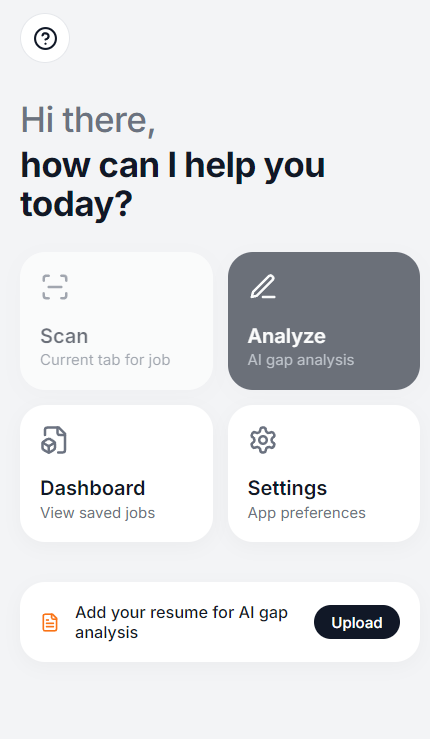
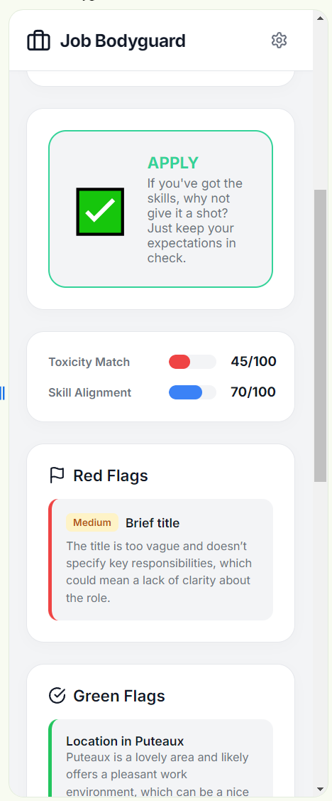
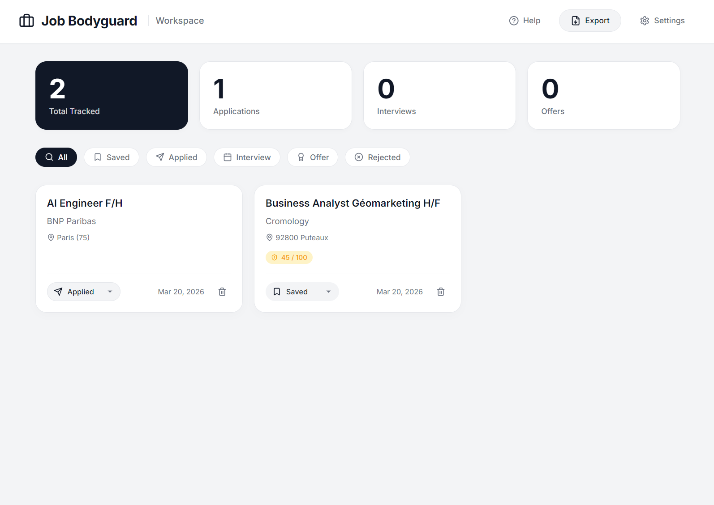
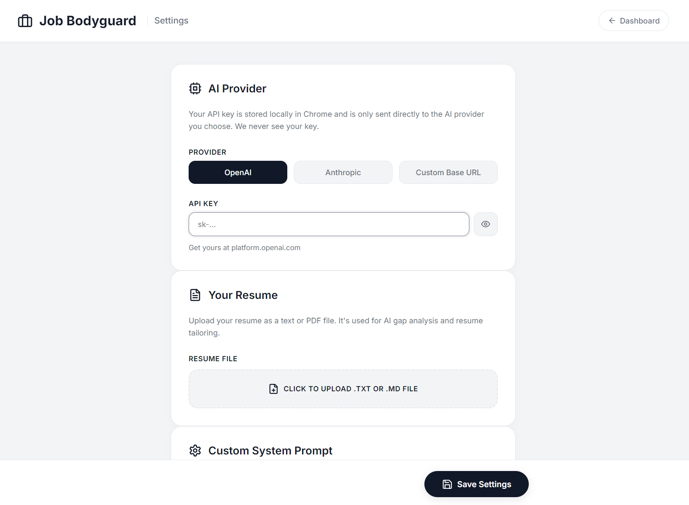

<div align="center">
  
  <h1>Job Bodyguard</h1>
  <p><em>Your intelligent companion for navigating the job application process.</em></p>

  <a href="https://chrome.google.com/webstore">
    
  </a>
  <a href="https://reactjs.org/">
    
  </a>
  <a href="https://vitejs.dev/">
    
  </a>
</div>

---

**Job Bodyguard** is a Chrome Extension designed to intelligently track, analyze, and guard your job applications. It analyzes job descriptions directly from standard job boards, providing valuable insights into potential red flags, missing skill requirements, and salary estimations.

> **Disclaimer**: I know many of you used and loved this application. However, it is time for me to move on, and I will no longer be actively maintaining it. I am keeping it open-source, so feel free to fork the repository, propose modifications, and I may merge them. If you encounter any critical bugs or issues, feel free to open an issue and I will do my best to address them.

## Key Features

- **Automated Data Extraction**: Pulls details, company statistics, and locations seamlessly from job boards like LinkedIn, Indeed, and HH.
- **Gap Analysis**: Correlates your resume against the job description to highlight missing skills or gaps in experience.
- **Red Flag Detection**: Identifies potentially concerning phrases in job descriptions (e.g., hidden salaries, unrealistic requirements).
- **Application Tracking**: Easily organize your applications directly from the browser into categories such as Saved, Applied, Interview, Offer, or Rejected.
- **Local & Secure Data**: Standard data extraction operates statically, and syncs your tracking data securely using Chrome Storage.

---

## Interface Overview

### Extension Action Menu
Provides immediate access to your most recent targets and triggers rapid page analysis.


### On-Page Analysis Hover
A smooth floating element that natively integrates onto job postings, providing an immediate summary of the role.


### Thorough Sidepanel
Unlocks in-depth structural analysis. Review pros and cons of an employer and ascertain how well your profile aligns with expectations.


### Master Tracking Dashboard
Review your aggregate application statuses, effectively rendering out your progress efficiently.


### System Settings
Setup your personalized extraction configurations, API limits, prompt overrides, and CV content directly within the configuration menu.


---

## Installation Guide

1. Clone the repository to your local machine:
   ```bash
   git clone https://github.com/Astoriel/Job-Bodyguard.git
   cd Job-Bodyguard
   ```
2. Load the extension into Google Chrome:
   - Navigate to `chrome://extensions/`
   - Enable **Developer mode** in the top right corner.
   - Click **Load unpacked** and select the `dist` folder.

## Technologies

- **React.js & TypeScript**
- **Vite**

## License

This project is open-source. See the repository for exact licensing terms. If you encounter an issue, please feel free to report bugs or file pull requests via GitHub issues.
